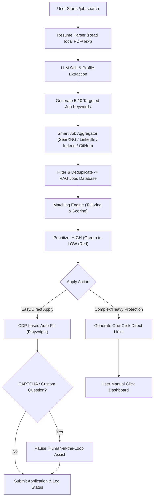

# Master Plan: Job Search Loop & Local Integrations (`/job-search`)

This document lays out the comprehensive design and architecture of the custom job search and auto-apply pipeline for `open-agent`. 

---

## 1. Modular Loop Architecture (`job_search.py`)

The `/job-search` command will activate a specialized agentic loop that performs profile matching, job scouting, auto-filling application forms, and logging progress locally.



---

## 2. Bypassing Anti-Bot Systems (LinkedIn/Indeed/Workday)

### The Core Problem
Most major job boards (Indeed, LinkedIn) and Applicant Tracking Systems (ATS) use sophisticated anti-bot detectors (like Cloudflare and DataDome). Running automated head-less bots often triggers:
- Immediate IP bans.
- CAPTCHA walls.
- Account suspensions.

### The Solution: Hybrid CDP + Human-in-the-Loop
Rather than building a fully automated headless bot, `open-agent` connects directly to the user's **already running Chrome profile** using Chrome's **Remote Debugging Port (`--remote-debugging-port=9222`)**:

1. **Authentication Persistence**: The agent inherits the active login session, valid cookies, and session state. The user does not need to store passwords in plain text.
2. **CDP Web Automation**: Using Playwright to control the running headed browser, the agent inputs the user's name, email, phone number, LinkedIn URL, GitHub URL, and uploads their resume file.
3. **MFA and CAPTCHA Handling**: If a verification step or CAPTCHA triggers, the agent prints a console alert:
   `⚠️ CAPTCHA detected. Please solve it in your browser window and press [Enter] to resume.`
4. **Interactive Form Filling**: For custom questions (e.g. *"What is your expected compensation?"*), the agent prompts the user in the CLI.

---

## 3. Local Jobs Database & Scoring Engine

### Database Schema (`~/.agentic-loop/jobs_database.json`)
```json
{
  "jobs": [
    {
      "id": "job_987654",
      "title": "Software Engineer",
      "company": "TechCorp",
      "platform": "Lever",
      "url": "https://jobs.lever.co/techcorp/987654",
      "match_score": 94,
      "match_level": "GREEN",
      "status": "pending_review",
      "date_found": "2026-06-21T18:00:00"
    }
  ]
}
```

### Match Probability Scoring
The engine compares the extracted skills from the resume with the requirements list inside the scraped job details:
- **GREEN (80% - 100% chance)**: Near perfect stack match.
- **YELLOW (50% - 79% chance)**: Mostly compatible, but missing non-critical tools.
- **RED (0% - 49% chance)**: Mismatched tech stack or seniority.
